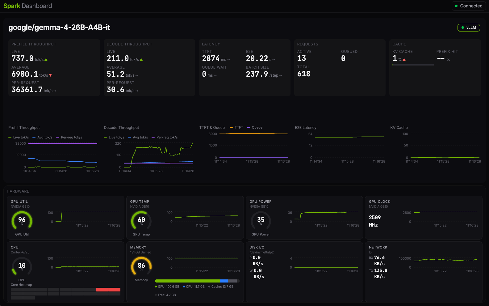

# Spark Dashboard

Real-time hardware and LLM inference monitoring for Linux systems with NVIDIA
GPUs. Developed and tested on the NVIDIA DGX Spark, but works on any Linux
host with NVIDIA drivers — discrete-GPU workstations, DGX boxes, cloud VMs.
A Rust backend collects GPU, CPU, memory, disk, and network metrics alongside
vLLM engine statistics and streams them over WebSocket to a React frontend.

    



## Quick Start

### Install on your Linux host

Run as your normal user on any Linux host with NVIDIA drivers (requires Rust 1.75+):

```bash
cargo install spark-dashboard
sudo "$(command -v spark-dashboard)" service install
systemctl status spark-dashboard
```

The dashboard is now served on port 3000. See [Install on your Linux host](#install-on-your-linux-host-1)
for the full guide, config overrides, and uninstall.

### Develop locally

```bash
git clone https://github.com/niklasfrick/spark-dashboard.git
cd spark-dashboard
cp .env.example .env           # edit with your remote host's user/host
./dev/dev.sh
```

Open `http://localhost:5173` in your browser. See [`dev/README.md`](./dev/README.md)
for details on what each script does.

## Features

**Hardware Monitoring** (1s polling via NVML, sysinfo, procfs)
- GPU utilization, temperature, power draw, clock frequencies, fan speed
- GPU event detection — thermal throttling, hardware slowdown, power brake
- CPU aggregate and per-core utilization with heatmap
- Memory breakdown — CPU RAM and GPU VRAM separately on discrete-GPU hosts,
  or a single unified pool on systems where CPU and GPU share memory
  (e.g. DGX Spark GB10, GH200)
- Disk and network I/O throughput

**LLM Engine Monitoring** (vLLM via Prometheus metrics)
- Tokens per second (generation + prompt)
- Time to first token, end-to-end latency, queue time
- Active/queued requests, batch size
- KV cache utilization, prefix cache hit rate
- Automatic engine discovery via process scan and Docker API

**Dashboard**
- Arc gauges, time-series charts, sparklines, per-core heatmap
- 15-minute rolling history with circular buffers
- Connection status badge, staleness detection, auto-reconnect
- Multi-engine tabs when multiple inference servers are running

## Architecture

```
┌──────────────────────┐         WebSocket (JSON)         ┌────────────────────┐
│     Rust Backend     │ ──────────────────────────────▶  │  React Frontend    │
│                      │                                  │                    │
│  Tokio tasks:        │                                  │  useMetrics hook   │
│  ├─ metrics_collector│  broadcast channel (capacity 16) │  ├─ WebSocket conn │
│  │  (GPU/CPU/mem/…) ─┼──▶ tx ──▶ ws_handler ──▶ client │  ├─ batch flush 2s │
│  └─ engine_collector │                                  │  └─ circular bufs  │
│     (vLLM/Docker)    │                                  │                    │
│                      │  Static files (rust-embed)       │  Recharts, Tailwind│
│  Axum router         │ ◀──── production only ─────────  │  shadcn/ui         │
└──────────────────────┘                                  └────────────────────┘
  Linux host (e.g. DGX Spark)                                  Browser
```

Two independent Tokio tasks run in parallel — one for hardware metrics (NVML,
sysinfo, procfs) and one for engine detection/polling. Both feed into a
broadcast channel that fans out to all connected WebSocket clients. In
production the frontend is embedded in the binary via `rust-embed`; in
development, Vite serves the frontend locally and proxies API/WebSocket
traffic to the remote backend.

## Configuration

All operator config lives in a repo-root `.env` file. Copy the template and
edit:

```bash
cp .env.example .env
```

| Variable           | Purpose                                                      |
|--------------------|--------------------------------------------------------------|
| `DEPLOY_USER`      | SSH user on the remote host (required)                       |
| `DEPLOY_HOST`      | Hostname or IP of the remote host (required)                 |
| `DEPLOY_DIR`       | Project path on the remote host, relative to remote home (default `spark-dashboard`) |
| `VITE_BACKEND_URL` | Where Vite proxies `/ws` and `/api` (default `http://localhost:3000`) |

Legacy `SPARK_USER` / `SPARK_HOST` / `SPARK_DIR` are still accepted as a
fallback when `DEPLOY_*` are unset — `dev.sh` prints a one-line deprecation
note. The scripts in `dev/` source this file; Vite picks up `VITE_*` variables
automatically. `.env` is gitignored — never commit it.

## Install on your Linux host

The dashboard runs as a supervised `systemd` service. Two install paths; both
build from source on the host.

### Option A — via cargo (recommended)

```bash
# On the host. Requires Rust 1.75+, NVIDIA drivers, and internet access.
cargo install spark-dashboard
sudo "$(command -v spark-dashboard)" service install
systemctl status spark-dashboard
```

`cargo install` pulls the crate from [crates.io](https://crates.io/crates/spark-dashboard)
and compiles it locally. `service install` copies the binary to
`/usr/local/bin`, creates a locked-down `spark-dashboard` system user (added
to `video`, `render`, `docker` groups for NVML and Docker access), writes the
systemd unit, and enables it.

> **Why `sudo "$(command -v spark-dashboard)"`?** `cargo install` drops the
> binary in `~/.cargo/bin`, but `sudo` resets PATH via `secure_path` and
> doesn't inherit that directory — so plain `sudo spark-dashboard` would
> fail with "command not found." `command -v` resolves the absolute path
> in your shell before `sudo` runs. After `service install` copies the
> binary to `/usr/local/bin`, subsequent `sudo spark-dashboard …` calls
> (e.g. `service status`, `service uninstall`) work normally.

### Option B — from a local checkout

Use this when you want to install without crates.io (audit the source,
air-gapped install, or deploy an unreleased commit).

```bash
# On the host. Run as your normal user — the script escalates to sudo
# only for the systemd wiring step.
git clone https://github.com/niklasfrick/spark-dashboard.git
cd spark-dashboard
./packaging/install.sh
```

This builds the frontend (`npm run build`) and the Rust binary
(`cargo build --release`), then hands off to the same `service install`
logic as Option A. You'll be prompted for your sudo password once, when
the service is installed.

### Managing the service

```bash
sudo systemctl {start|stop|restart} spark-dashboard
journalctl -u spark-dashboard -f          # follow logs
sudo spark-dashboard service status       # same as `systemctl status`
```

Optional overrides live in `/etc/spark-dashboard/config.env` — set
`SPARK_DASHBOARD_PORT`, `SPARK_DASHBOARD_BIND`, `SPARK_DASHBOARD_POLL_INTERVAL`,
`SPARK_DASHBOARD_GPU_INDEX`, or `RUST_LOG`, then
`sudo systemctl restart spark-dashboard`.

### Upgrade

```bash
# Option A
cargo install --force spark-dashboard && sudo spark-dashboard service install

# Option B
cd spark-dashboard && git pull && ./packaging/install.sh
```

Re-running `service install` is idempotent: it stops the service, swaps the
binary, and starts it again, preserving `/etc/spark-dashboard/config.env`.

### Uninstall

```bash
sudo spark-dashboard service uninstall         # keep /etc/spark-dashboard
sudo spark-dashboard service uninstall --purge # remove everything
```

### CLI options

```
spark-dashboard [OPTIONS]                 run the server (default)
spark-dashboard service install [--prefix /usr/local]
spark-dashboard service uninstall [--purge]
spark-dashboard service status

  -p, --port <PORT>           Listen port [default: 3000] [env: SPARK_DASHBOARD_PORT]
  -b, --bind <BIND>           Bind address [default: 0.0.0.0] [env: SPARK_DASHBOARD_BIND]
      --poll-interval <MS>    Polling interval ms [default: 1000] [env: SPARK_DASHBOARD_POLL_INTERVAL]
      --gpu-index <IDX>       NVML GPU index to monitor [default: 0] [env: SPARK_DASHBOARD_GPU_INDEX]
      --engine <TYPE>         Manual engine type (e.g. vllm)
      --engine-url <URL>      Manual engine endpoint (requires --engine)
```

On multi-GPU hosts use `--gpu-index` to select which device the dashboard
monitors. Engines are auto-detected via process scan and Docker API. Use
`--engine` and `--engine-url` to override when auto-detection doesn't work.

## Development

### Prerequisites

- **Local machine** (macOS or Linux): Node.js 20+, npm, rsync, ssh
- **Remote host**: Linux + NVIDIA drivers, Rust 1.75+, SSH access with key-based auth (no password prompts)
- Optional: `brew install fswatch` for instant file-change detection (the
  watcher falls back to 2s polling without it)

### Running the dev environment

```bash
./dev/dev.sh
```

The script handles everything:

1. **Syncs** the full project to the remote host via rsync
2. **Builds** the Rust backend on the remote host (`cargo build --release`)
3. **Starts** the backend on the remote host (port 3000)
4. **Starts** the Vite dev server locally (port 5173)
5. **Watches** `src/` and `Cargo.toml` for Rust changes — auto-syncs and rebuilds on the remote host

| What you edit                      | What happens                                                      |
|------------------------------------|-------------------------------------------------------------------|
| Frontend files (`frontend/src/`)   | Vite hot-reloads instantly in the browser                         |
| Backend files (`src/`, `Cargo.toml`) | Auto-detected → rsync to remote host → rebuild → restart (~compile time) |

Useful while `dev.sh` is running:

```bash
# Watch backend logs in another terminal
ssh "${DEPLOY_USER}@${DEPLOY_HOST}" tail -f /tmp/spark-dashboard.log

# Press Ctrl+C in the dev.sh terminal to stop everything (cleans up the remote process too)
```

### How the proxy works

By default, Vite proxies `/ws` and `/api` to `localhost:3000` — this works out
of the box with any SSH tunnel that maps the remote host's port 3000 to your
local machine.

```
Browser → localhost:5173/ws  → Vite proxy → localhost:3000/ws (forwarded to remote)
Browser → localhost:5173/api → Vite proxy → localhost:3000/api (forwarded to remote)
```

To connect directly over the network instead, set in `.env`:

```bash
VITE_BACKEND_URL=http://${DEPLOY_HOST}:3000
```

The frontend connects to the WebSocket using `window.location.host`, so the
proxy is transparent — no code changes between dev and production.

## Releases

Releases are cut from `main` via [release-please](https://github.com/googleapis/release-please) —
conventional commits drive the version bump, merging the release PR tags
`vX.Y.Z` and triggers `cargo publish` to crates.io. `main` always reflects
the latest stable version; see [CHANGELOG.md](./CHANGELOG.md) for release notes.

## Testing

```bash
# Frontend
cd frontend && npm test

# Backend (on Linux)
cargo test
```

Backend tests include platform-aware stubs — GPU and memory tests validate
real NVML/procfs parsing on Linux, with compile-time stubs on other platforms.

## Project Structure

```
├── src/
│   ├── main.rs                 CLI args, task spawning, server startup
│   ├── server.rs               Axum router, static file serving
│   ├── ws.rs                   WebSocket handler
│   ├── metrics/
│   │   ├── mod.rs              MetricsSnapshot, collector loop
│   │   ├── gpu.rs              NVML GPU metrics + event detection
│   │   ├── cpu.rs              CPU aggregate + per-core
│   │   ├── memory.rs           System RAM + GPU VRAM + unified-memory detection
│   │   ├── disk.rs             Disk I/O rates
│   │   └── network.rs          Network I/O rates
│   └── engines/
│       ├── mod.rs              Engine trait, state machine, collector
│       ├── detector.rs         Process scan + Docker discovery
│       ├── vllm.rs             vLLM adapter (Prometheus parsing)
│       └── prometheus.rs       Prometheus text-format parser
├── frontend/
│   └── src/
│       ├── hooks/              useMetrics, useMetricsHistory
│       ├── components/
│       │   ├── views/          Dashboard, GlanceableView, DetailedView
│       │   ├── engines/        EngineSection, EngineCard
│       │   ├── charts/         TimeSeriesChart, Sparkline, CoreHeatmap
│       │   └── gauges/         ArcGauge
│       ├── types/              TypeScript type definitions
│       └── lib/                Circular buffer, formatting, theme
├── dev/
│   ├── dev.sh                  Dev loop (local frontend + remote backend)
│   └── README.md               Operator docs
├── .env.example                Configuration template
├── LICENSE                     MIT
├── CONTRIBUTING.md
└── Cargo.toml
```

## Contributing

See [CONTRIBUTING.md](./CONTRIBUTING.md).

## License

MIT — see [LICENSE](./LICENSE).
